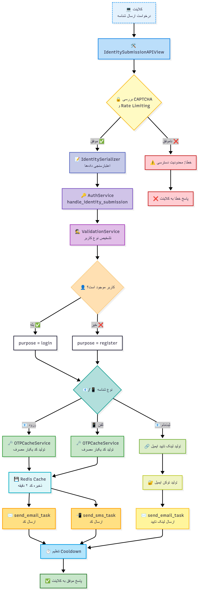
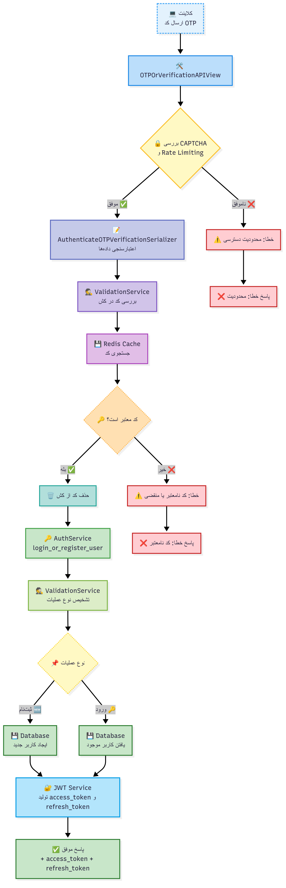
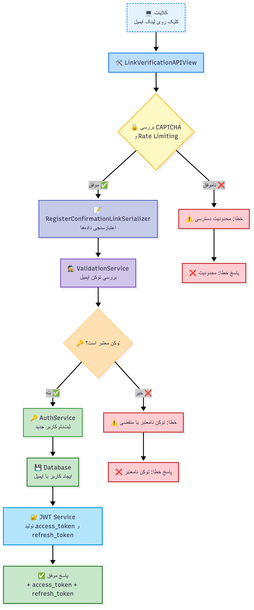
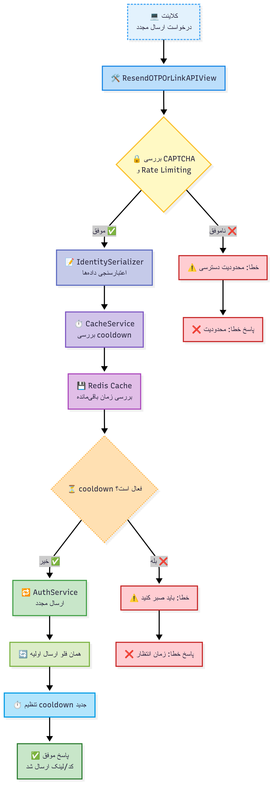
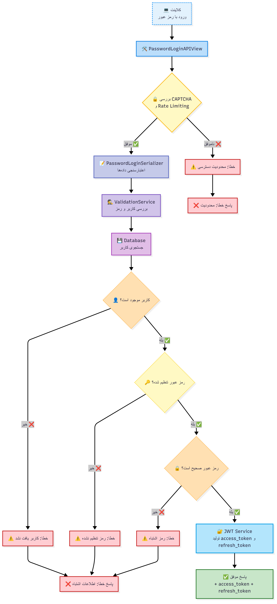
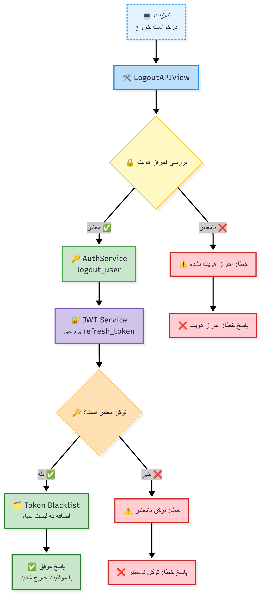
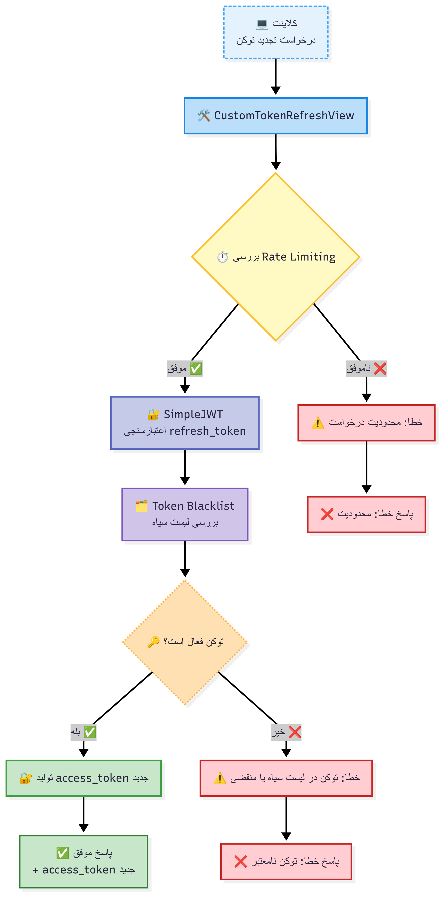
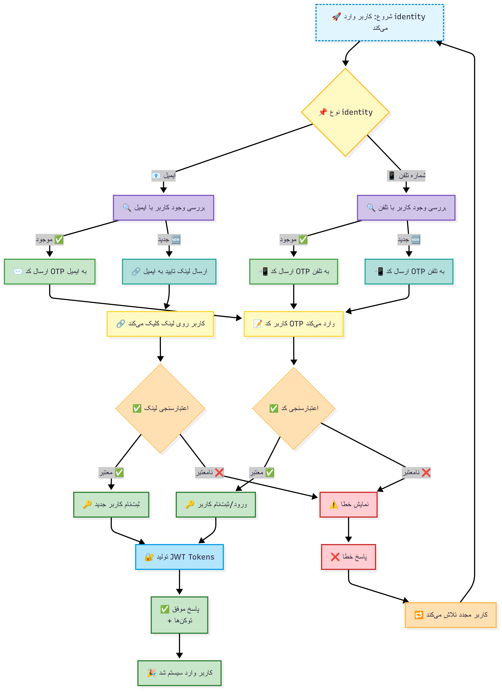
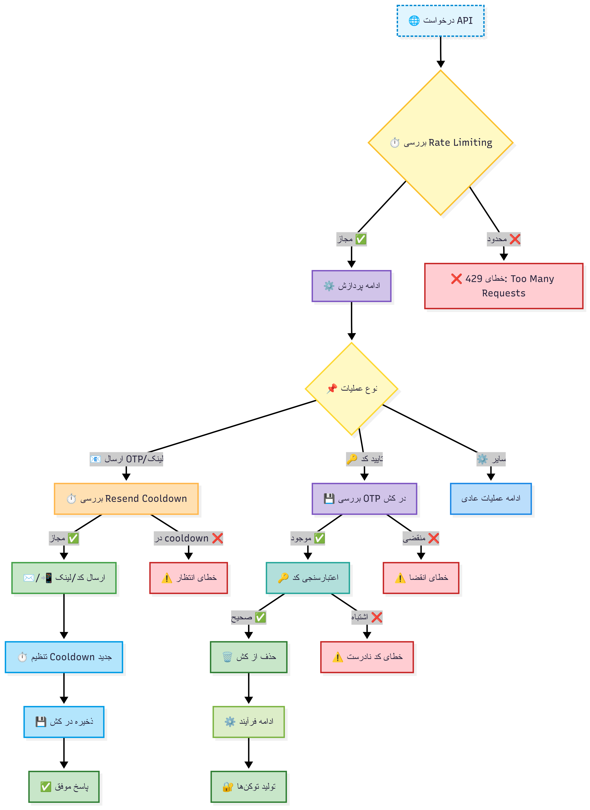

# فلوهای احراز هویت - Accounts App

این سند شامل نمودارهای ساده فلوهای احراز هویت سیستم Learnfolio است که با استفاده از Mermaid.js ترسیم شده‌اند.

## 1. فلو ارسال شناسه (Identity Submission)

این فلو زمانی اجرا می‌شود که کاربر ایمیل یا شماره تلفن خود را برای ورود یا ثبت‌نام ارسال می‌کند.

## 2. فلو تایید کد OTP

این فلو برای تایید کد OTP ارسال شده به ایمیل یا شماره تلفن استفاده می‌شود.

## 3. فلو تایید لینک ایمیل

این فلو برای تایید لینک‌های ارسال شده به ایمیل در فرآیند ثبت‌نام استفاده می‌شود.

## 4. فلو ارسال مجدد کد/لینک

این فلو برای ارسال مجدد کد OTP یا لینک تایید استفاده می‌شود.

## 5. فلو ورود با رمز عبور

این فلو برای ورود کاربران با استفاده از رمز عبور استفاده می‌شود.

## 6. فلو خروج کاربر

این فلو برای خروج کاربر و ابطال توکن‌ها استفاده می‌شود.

## 7. فلو تجدید توکن

این فلو برای تجدید access token با استفاده از refresh token استفاده می‌شود.

## 8. فلو کامل احراز هویت (جامع)

این نمودار فلو کامل احراز هویت از ابتدا تا انتها را نشان می‌دهد.

## 9. فلو مدیریت کش و Rate Limiting

این نمودار نحوه مدیریت کش و محدودیت‌های نرخ درخواست را نشان می‌دهد.

## توضیحات تفصیلی کلاسها و متدها

### 🔐 کلاس‌های اصلی API

#### **IdentitySubmissionAPIView**
- **متد**: `post(request)`
- **عملکرد**: دریافت ایمیل یا شماره تلفن از کاربر و تشخیص نوع عملیات (ورود/ثبت‌نام)
- **اعتبارسنجی**: CAPTCHA + Rate Limiting + IdentitySerializer
- **خروجی**: ارسال کد OTP یا لینک تایید + تنظیم cooldown
- **مسیر**: `/api/auth/v1/submit-identity/`

#### **OTPOrVerificationAPIView**
- **متد**: `post(request)`
- **عملکرد**: تایید کد 6 رقمی OTP و ورود/ثبت‌نام کاربر
- **اعتبارسنجی**: CAPTCHA + Rate Limiting + AuthenticateOTPVerificationSerializer
- **منطق**: بررسی کد در Redis Cache → حذف کد → ایجاد/یافتن کاربر → تولید JWT
- **خروجی**: access_token + refresh_token
- **مسیر**: `/api/auth/v1/verify-otp/`

#### **LinkVerificationAPIView**
- **متد**: `post(request)`
- **عملکرد**: تایید لینک ایمیل برای ثبت‌نام کاربران جدید
- **اعتبارسنجی**: CAPTCHA + Rate Limiting + RegisterConfirmationLinkSerializer
- **منطق**: verify_email_token() → ایجاد کاربر جدید → تولید JWT
- **خروجی**: access_token + refresh_token
- **مسیر**: `/api/auth/v1/verify-link/`

#### **ResendOTPOrLinkAPIView**
- **متد**: `post(request)`
- **عملکرد**: ارسال مجدد کد OTP یا لینک تایید
- **اعتبارسنجی**: CAPTCHA + ResendOTPOrLinkThrottle + IdentitySerializer
- **منطق**: can_resend() → handle_identity_submission() → set_resend_cooldown()
- **محدودیت**: cooldown 2 دقیقه‌ای بین درخواست‌ها
- **مسیر**: `/api/auth/v1/resend-otp-or-link/`

#### **PasswordLoginAPIView**
- **متد**: `post(request)`
- **عملکرد**: ورود با ایمیل/تلفن + رمز عبور
- **اعتبارسنجی**: CAPTCHA + Rate Limiting + PasswordLoginSerializer
- **منطق**: validate_user_with_password() → بررسی وجود کاربر → تطبیق رمز → تولید JWT
- **خروجی**: access_token + refresh_token
- **مسیر**: `/api/auth/v1/login-password/`

#### **LogoutAPIView**
- **متد**: `post(request)`
- **عملکرد**: خروج امن کاربر و ابطال refresh_token
- **اعتبارسنجی**: UserIsAuthenticated
- **منطق**: logout_user() → RefreshToken.blacklist() → ابطال توکن
- **خروجی**: پیام موفقیت با status 205
- **مسیر**: `/api/auth/v1/logout/`

#### **CustomTokenRefreshView**
- **متد**: `post(request)` (ارث‌بری از TokenRefreshView)
- **عملکرد**: تجدید access_token با refresh_token
- **اعتبارسنجی**: TokenRefreshAnonThrottle
- **منطق**: بررسی blacklist → تولید access_token جدید
- **خروجی**: access_token جدید
- **مسیر**: `/api/auth/v1/token/refresh/`

### 🛠️ سرویس‌های پشتیبان

#### **AuthService (auth_services.py)**
- **handle_identity_submission()**: تشخیص نوع کاربر و ارسال کد/لینک
- **login_or_register_user()**: ورود یا ثبت‌نام بر اساس شناسه
- **generate_tokens_for_user()**: تولید JWT tokens برای کاربر
- **logout_user()**: ابطال refresh_token در خروج
- **send_otp_for_phone()**: ارسال کد OTP به شماره تلفن
- **send_auth_email()**: ارسال کد/لینک به ایمیل

#### **ValidationService (validation_services.py)**
- **get_identity_purpose()**: تشخیص هدف (login/register/reset_password)
- **get_valid_otp()**: اعتبارسنجی کد OTP از کش
- **verify_email_link()**: تایید لینک ایمیل
- **validate_user_with_password()**: بررسی کاربر و رمز عبور

#### **OTPCacheService (cache_services.py)**
- **generate_otp()**: تولید کد 6 رقمی و ذخیره در Redis
- **_make_key()**: ایجاد کلید منحصربه‌فرد برای کش
- **can_resend()**: بررسی امکان ارسال مجدد
- **set_resend_cooldown()**: تنظیم محدودیت زمانی

### 🔒 لایه‌های امنیتی

#### **CAPTCHA (Cloudflare Turnstile)**
- **دکوراتور**: `@captcha_required`
- **عملکرد**: جلوگیری از حملات ربات‌ها
- **اعمال**: تمام endpoint های عمومی

#### **Rate Limiting**
- **CustomAnonThrottle**: محدودیت برای کاربران ناشناس
- **ResendOTPOrLinkThrottle**: محدودیت ویژه ارسال مجدد
- **TokenRefreshAnonThrottle**: محدودیت تجدید توکن

#### **Permissions**
- **UserIsNotAuthenticated**: فقط کاربران غیر وارد شده
- **UserIsAuthenticated**: فقط کاربران وارد شده

#### **JWT Security**
- **Token Blacklisting**: ابطال توکن‌ها در خروج
- **Refresh Token**: امنیت بالا با انقضای کوتاه‌مدت
- **Access Token**: دسترسی موقت به منابع

### ⚡ مدیریت کش و Performance

#### **Redis Cache**
- **OTP Storage**: ذخیره کدهای OTP با TTL 2 دقیقه
- **Cooldown Management**: جلوگیری از spam با timeout
- **Key Pattern**: `otp:{identity}:{purpose}`

#### **Async Tasks (Celery)**
- **send_email_task**: ارسال ایمیل به صورت async
- **send_sms_task**: ارسال SMS به صورت async
- **Performance**: عدم blocking در ارسال پیام‌ها
