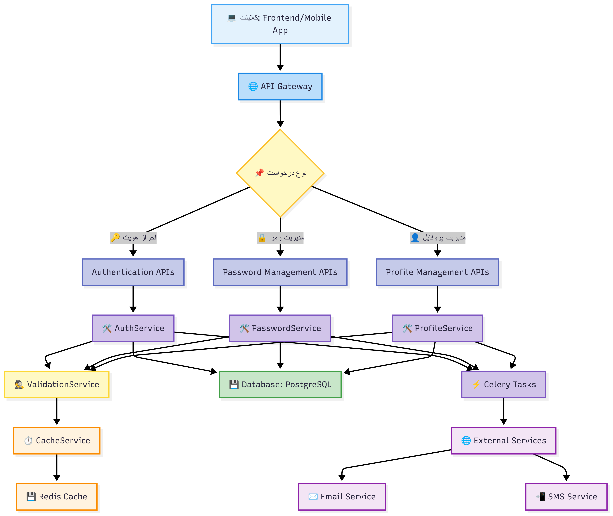
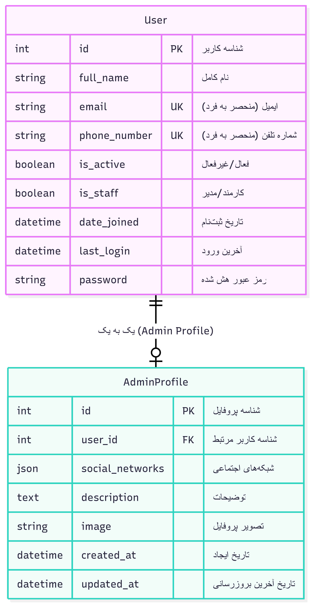
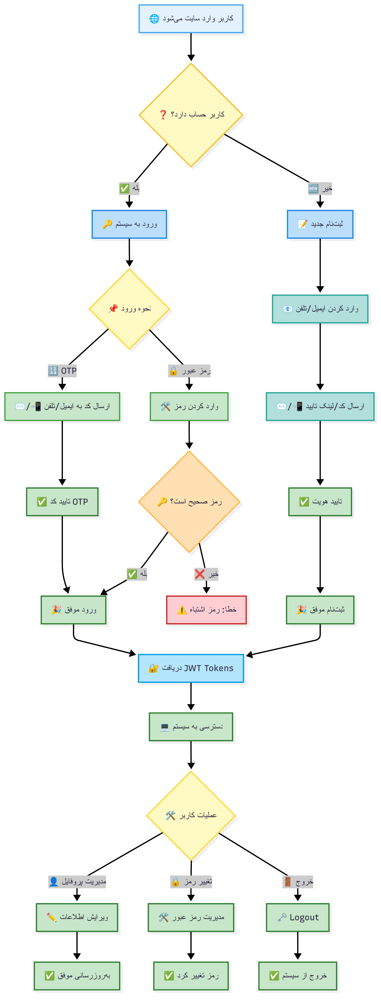
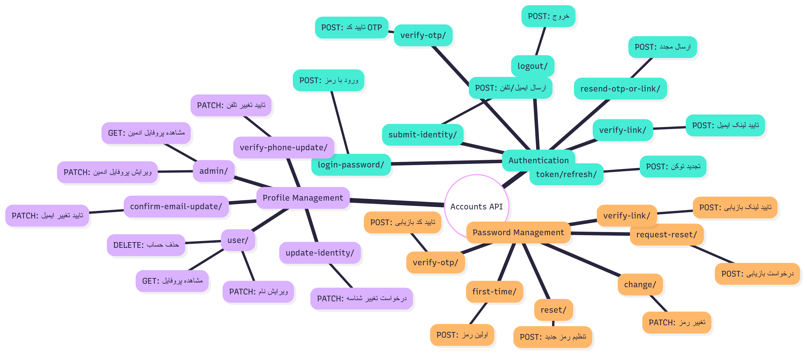
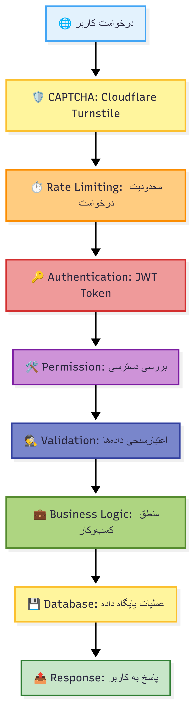
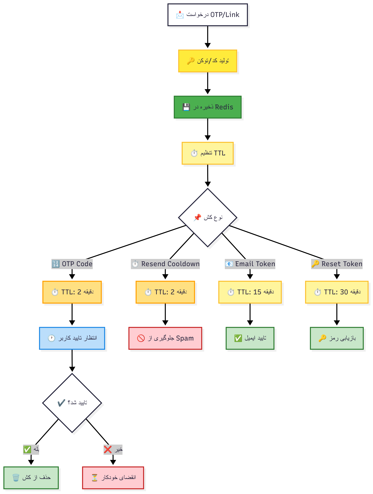

# معماری کامل سیستم Accounts - Learnfolio

این سند نمای کلی ساده از معماری و فلوهای سیستم احراز هویت و مدیریت حساب‌های کاربری را ارائه می‌دهد.

## نمای کلی معماری

## مدل‌های داده

## فلو کامل سیستم احراز هویت

## نقشه API Endpoints

## لایه‌های امنیتی

## مدیریت کش 

---

# توضیحات تفصیلی معماری سیستم Accounts

## لایه‌های معماری

### 1. Client Layer (لایه کلاینت)
**شامل:**
- Frontend React Application
- Mobile Applications
- API Clients

**مسئولیت‌ها:**
- رابط کاربری برای احراز هویت
- مدیریت JWT tokens در سمت کلاینت
- ارسال درخواست‌ها به API

### 2. API Layer (لایه API)
**شامل:**
- Authentication APIs: مدیریت ورود/ثبت‌نام
- Password Management APIs: مدیریت رمز عبور
- Profile Management APIs: مدیریت پروفایل کاربران

**ویژگی‌ها:**
- RESTful API design
- Django REST Framework
- Swagger/OpenAPI documentation

### 3. Service Layer (لایه سرویس)
**شامل:**
- `AuthService`: منطق احراز هویت
- `ValidationService`: اعتبارسنجی داده‌ها
- `PasswordService`: مدیریت رمز عبور
- `ProfileService`: مدیریت پروفایل
- `CacheService`: مدیریت کش

**اصول طراحی:**
- جداسازی منطق کسب‌وکار از Views
- قابلیت استفاده مجدد
- تست‌پذیری بالا

### 4. Infrastructure Layer (لایه زیرساخت)
**شامل:**
- Redis Cache: ذخیره‌سازی موقت
- PostgreSQL Database: ذخیره‌سازی دائمی
- Celery Tasks: پردازش ناهمزمان
- External Services: ایمیل و SMS

## مدیریت امنیت

### احراز هویت (Authentication)
- **JWT Tokens:** Access و Refresh tokens
- **Token Blacklisting:** برای خروج امن
- **Multi-factor Authentication:** OTP و Email verification

### مجوزدهی (Authorization)
- **Permission Classes:** کنترل دسترسی
- **Role-based Access:** کاربر عادی و ادمین
- **Resource-level Permissions:** دسترسی به منابع خاص

### محافظت در برابر حملات
- **CAPTCHA:** Cloudflare Turnstile
- **Rate Limiting:** محدودیت درخواست
- **CSRF Protection:** محافظت در برابر CSRF
- **SQL Injection Prevention:** استفاده از ORM

## مدیریت کارایی

### کش‌سازی (Caching)
- **Redis Cache:** برای OTP و session data
- **TTL Management:** مدیریت انقضا خودکار
- **Cache Invalidation:** حذف کش منقضی

### پردازش ناهمزمان
- **Celery Tasks:** برای ارسال ایمیل و SMS
- **Background Processing:** عدم مسدود شدن درخواست‌ها
- **Task Monitoring:** نظارت بر وظایف

## مدیریت خطا و لاگ‌گیری

### مدیریت خطا
- **Custom Exception Classes:** خطاهای سفارشی
- **Error Response Format:** فرمت یکسان پاسخ خطا
- **Graceful Degradation:** کاهش تدریجی عملکرد

### لاگ‌گیری
- **Structured Logging:** لاگ‌های ساختاریافته
- **Security Logging:** ثبت رویدادهای امنیتی
- **Performance Monitoring:** نظارت بر عملکرد

## خلاصه ویژگی‌های کلیدی

### 🔐 احراز هویت
- ورود/ثبت‌نام با ایمیل یا شماره تلفن
- پشتیبانی از OTP و لینک تایید
- ورود با رمز عبور
- مدیریت JWT tokens

### 🛡️ امنیت
- CAPTCHA برای جلوگیری از ربات‌ها
- Rate limiting برای جلوگیری از حملات
- Cooldown برای جلوگیری از spam
- Token blacklisting برای خروج امن

### 👤 مدیریت پروفایل
- ویرایش اطلاعات شخصی
- تغییر ایمیل/تلفن با تایید
- حذف حساب کاربری
- پروفایل ویژه ادمین‌ها

### 🔑 مدیریت رمز عبور
- بازیابی رمز فراموش شده
- تنظیم اولین رمز عبور
- تغییر رمز عبور موجود
- اعتبارسنجی قوی رمزها
