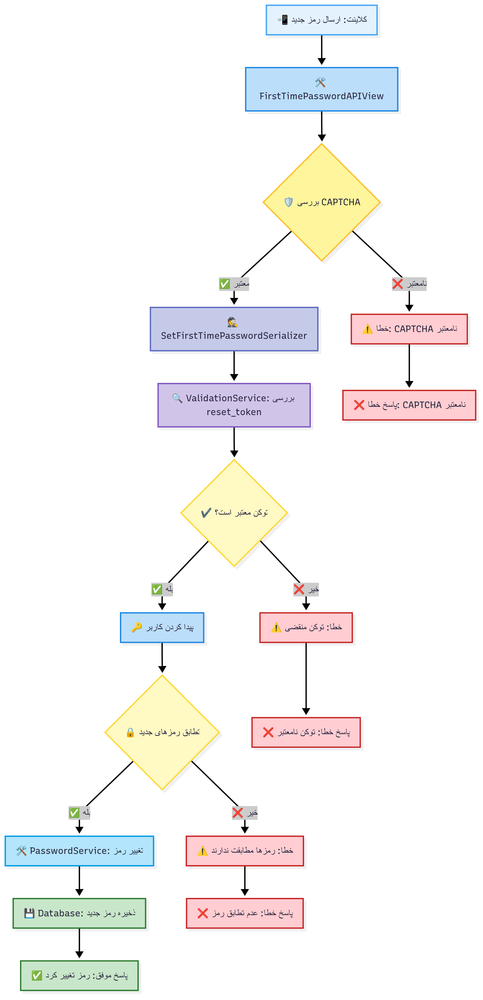
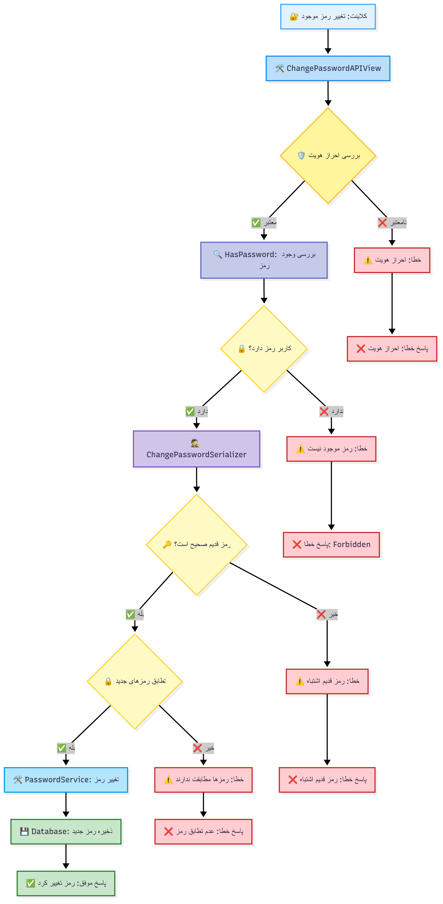

# فلوهای مدیریت رمز عبور - Accounts App

این سند شامل نمودارهای ساده فلوهای مدیریت رمز عبور در سیستم Learnfolio است.

## 1. فلو درخواست بازیابی رمز عبور

## 2. فلو تایید کد OTP برای بازیابی رمز عبور

## 3. فلو تایید لینک برای بازیابی رمز عبور

## 4. فلو تنظیم رمز عبور جدید

## 5. فلو تنظیم رمز عبور برای اولین بار

## 6. فلو تغییر رمز عبور

---

# توضیحات تفصیلی کلاس‌ها و متدهای مدیریت رمز عبور

## کلاس‌های اصلی API

### 1. RequestPasswordResetAPIView
**مسیر:** `/api/auth/v1/password/request-reset/`
**متد:** POST

**مسئولیت‌ها:**
- دریافت درخواست بازیابی رمز عبور با ایمیل یا شماره تلفن
- بررسی CAPTCHA و Rate Limiting
- ارسال لینک بازیابی به ایمیل یا کد OTP به تلفن

**سریالایزر:** `IdentitySerializer`
**امنیت:** Cloudflare Turnstile CAPTCHA، Rate Limiting، Cooldown 2 دقیقه‌ای

### 2. OTPVerificationPasswordResetAPIView
**مسیر:** `/api/auth/v1/password/verify-otp/`
**متد:** POST

**مسئولیت‌ها:**
- تایید کد OTP برای بازیابی رمز عبور
- تولید reset_token با انقضا 30 دقیقه‌ای

**سریالایزر:** `ResetOTPVerificationSerializer`
**امنیت:** CAPTCHA، Rate Limiting

### 3. LinkVerificationPasswordResetAPIView
**مسیر:** `/api/auth/v1/password/verify-link/`
**متد:** POST

**مسئولیت‌ها:**
- تایید لینک ایمیل برای بازیابی رمز عبور
- تولید reset_token با انقضا 30 دقیقه‌ای

**سریالایزر:** `ResetPasswordConfirmationLinkSerializer`
**امنیت:** CAPTCHA، Rate Limiting

### 4. ResetPasswordAPIView
**مسیر:** `/api/auth/v1/password/reset/`
**متد:** POST

**مسئولیت‌ها:**
- تنظیم رمز عبور جدید با استفاده از reset_token
- اعتبارسنجی تطابق رمزهای جدید

**سریالایزر:** `SetResetPasswordSerializer`
**امنیت:** CAPTCHA، اعتبارسنجی reset_token

### 5. FirstTimePasswordAPIView
**مسیر:** `/api/auth/v1/password/first-time/`
**متد:** POST

**مسئولیت‌ها:**
- تنظیم رمز عبور برای کاربرانی که قبلاً رمز نداشته‌اند
- بررسی عدم وجود رمز قبلی

**سریالایزر:** `SetFirstTimePasswordSerializer`
**امنیت:** `HasNoPassword` permission، احراز هویت JWT

### 6. ChangePasswordAPIView
**مسیر:** `/api/auth/v1/password/change/`
**متد:** PATCH

**مسئولیت‌ها:**
- تغییر رمز عبور موجود
- بررسی صحت رمز قدیم

**سریالایزر:** `ChangePasswordSerializer`
**امنیت:** `HasPassword` permission، احراز هویت JWT

## سرویس‌های پشتیبان

### PasswordService
**توابع کلیدی:**
- `handle_password_reset()`: مدیریت درخواست بازیابی رمز
- `generate_reset_password_token()`: تولید توکن بازیابی با انقضا 30 دقیقه
- `change_user_password()`: تغییر رمز عبور کاربر
- `get_user_by_identity()`: پیدا کردن کاربر با ایمیل یا تلفن

### ValidationService
**توابع کلیدی:**
- `get_valid_otp()`: اعتبارسنجی کد OTP
- `verify_email_link()`: تایید لینک ایمیل
- `validate_reset_password_token()`: اعتبارسنجی reset_token
- `get_identity_purpose()`: تشخیص نوع شناسه

### AuthService
**توابع کلیدی:**
- `send_auth_email()`: ارسال لینک بازیابی به ایمیل
- `send_otp_for_phone()`: ارسال کد OTP به تلفن

## ویژگی‌های امنیتی

### احراز هویت و مجوزها
- **JWT Token:** برای endpoint های تغییر رمز
- **HasPassword Permission:** بررسی وجود رمز برای تغییر
- **HasNoPassword Permission:** بررسی عدم وجود رمز برای تنظیم اولین بار
- **CAPTCHA:** Cloudflare Turnstile برای تمام endpoint های عمومی

### مدیریت توکن‌ها
- **Reset Token:** JWT با انقضا 30 دقیقه برای بازیابی رمز
- **Email Token:** توکن تایید ایمیل با انقضا محدود
- **OTP Cache:** کدهای یکبار مصرف با TTL 2 دقیقه در Redis

### محدودیت‌های امنیتی
- **Rate Limiting:** محدودیت درخواست برای جلوگیری از حملات
- **Cooldown:** 2 دقیقه انتظار بین درخواست‌های مجدد
- **امنیت اطلاعات:** پیام یکسان حتی برای کاربران غیرموجود

## وظایف ناهمزمان (Celery Tasks)

### send_email_task
- ارسال لینک‌های بازیابی رمز عبور
- اجرای ناهمزمان برای عدم مسدود شدن درخواست

### send_sms_task
- ارسال کدهای OTP برای بازیابی رمز
- اجرای ناهمزمان برای بهبود عملکرد

## انواع مدیریت رمز عبور

### 1. بازیابی رمز (Password Reset)
- برای کاربرانی که رمز خود را فراموش کرده‌اند
- نیاز به تایید هویت از طریق ایمیل یا تلفن
- تولید reset_token موقت

### 2. اولین رمز (First Time Password)
- برای کاربرانی که با OTP ثبت‌نام کرده‌اند
- نیاز به احراز هویت با JWT
- بررسی عدم وجود رمز قبلی

### 3. تغییر رمز (Change Password)
- برای کاربرانی که رمز موجود دارند
- نیاز به رمز قدیم و احراز هویت
- اعتبارسنجی رمز فعلی
