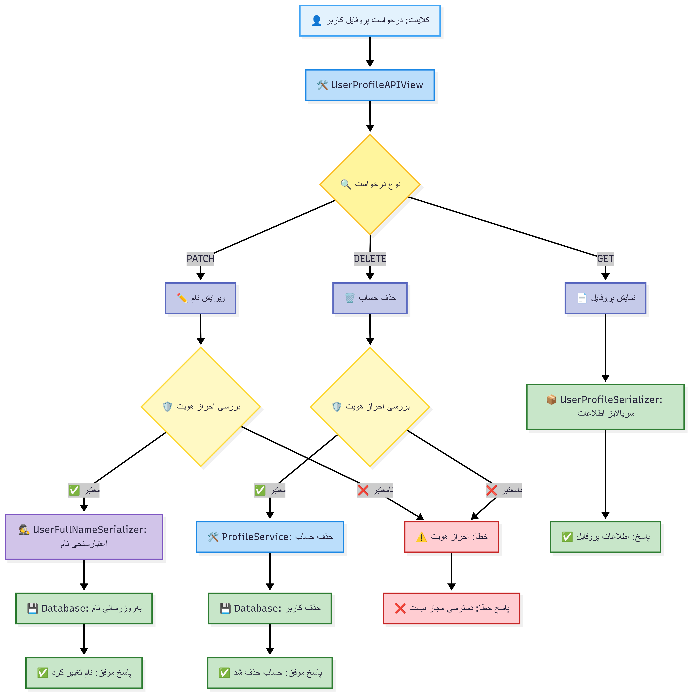
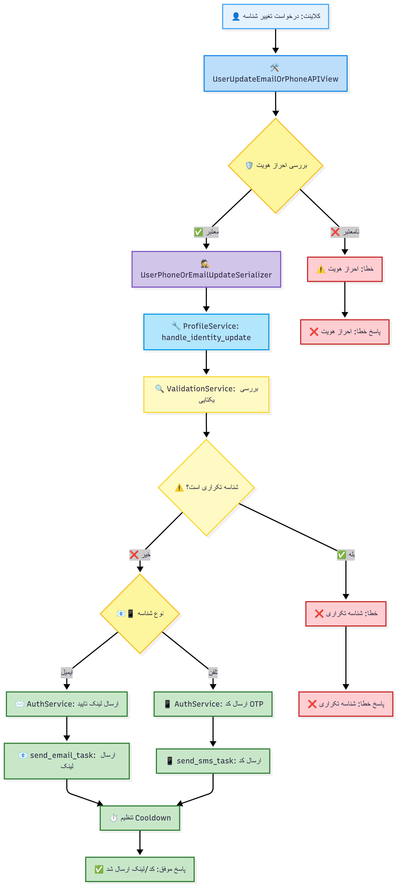
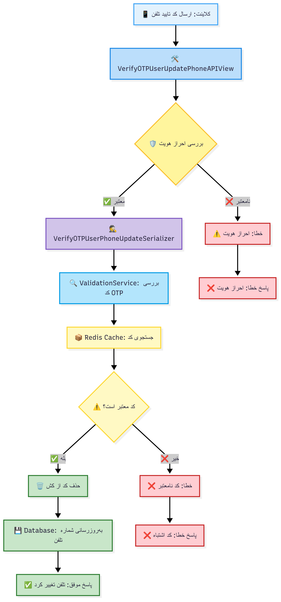
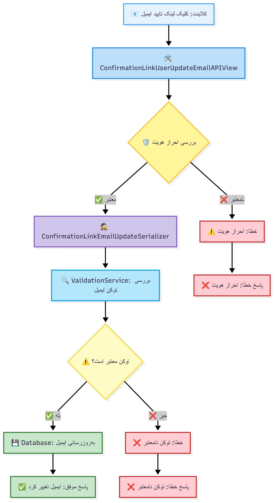

# فلوهای مدیریت پروفایل - Accounts App

این سند شامل نمودارهای ساده فلوهای مدیریت پروفایل کاربران و ادمین در سیستم Learnfolio است.

## 1. فلو مشاهده و ویرایش پروفایل کاربر

## 2. فلو مدیریت پروفایل ادمین

## 3. فلو درخواست تغییر ایمیل/تلفن

## 4. فلو تایید تغییر شماره تلفن

## 5. فلو تایید تغییر ایمیل

## توضیحات تفصیلی کلاسها و متدها

### 👤 کلاس‌های اصلی API

#### **UserProfileAPIView**
- **متدها**: `get()`, `patch()`, `delete()`
- **عملکرد**: مدیریت کامل پروفایل کاربران عادی
- **GET**: نمایش اطلاعات پروفایل با UserProfileSerializer
- **PATCH**: ویرایش نام کامل با UserFullNameSerializer
- **DELETE**: حذف حساب کاربری با delete_user_account()
- **مسیر**: `/api/auth/v1/profile/user/`

#### **AdminProfileAPIView**
- **متدها**: `get()`, `patch()`
- **عملکرد**: مدیریت پروفایل ادمین‌ها
- **دسترسی**: UserAdminIsAuthenticated
- **Parser**: MultiPartParser, FormParser (برای آپلود فایل)
- **GET**: نمایش پروفایل ادمین
- **PATCH**: ویرایش شبکه‌های اجتماعی، توضیحات، تصویر
- **مسیر**: `/api/auth/v1/profile/admin/`

#### **UserUpdateEmailOrPhoneAPIView**
- **متد**: `patch()`
- **عملکرد**: درخواست تغییر ایمیل یا شماره تلفن
- **اعتبارسنجی**: UserPhoneOrEmailUpdateSerilizer
- **منطق**: handle_identity_update() → بررسی یکتایی → ارسال کد/لینک
- **مسیر**: `/api/auth/v1/profile/update-identity/`

#### **VerifyOTPUserUpdatePhoneAPIView**
- **متد**: `patch()`
- **عملکرد**: تایید کد OTP برای تغییر شماره تلفن
- **اعتبارسنجی**: VerifyOTPUserPhoneUpdateSerilizer
- **منطق**: get_valid_otp() → حذف از کش → به‌روزرسانی تلفن
- **مسیر**: `/api/auth/v1/profile/verify-phone-update/`

#### **ConfirmationLinkUserUpdateEmailAPIView**
- **متد**: `patch()`
- **عملکرد**: تایید لینک برای تغییر ایمیل
- **اعتبارسنجی**: ConfirmationLinkEmailUpdateSerializer
- **منطق**: verify_email_link() → به‌روزرسانی ایمیل
- **مسیر**: `/api/auth/v1/profile/confirm-email-update/`

### 🛠️ سرویس‌های پشتیبان

#### **ProfileService (profile_services.py)**
- **handle_identity_update()**: مدیریت درخواست تغییر شناسه
- **delete_user_account()**: حذف امن حساب کاربری

#### **ValidationService (validation_services.py)**
- **بررسی یکتایی**: جلوگیری از تکراری بودن ایمیل/تلفن
- **verify_email_link()**: تایید لینک‌های ایمیل
- **get_valid_otp()**: اعتبارسنجی کدهای OTP

### 🔒 امنیت و دسترسی

#### **Permissions**
- **UserIsAuthenticated**: احراز هویت الزامی برای تمام عملیات
- **UserAdminIsAuthenticated**: دسترسی ویژه ادمین‌ها

#### **Rate Limiting**
- **CustomUserThrottle**: محدودیت درخواست برای کاربران وارد شده
- **No Throttle for GET**: عدم محدودیت برای مشاهده پروفایل

#### **Data Validation**
- **یکتایی شناسه**: جلوگیری از تکراری بودن ایمیل/تلفن
- **تایید دوگانه**: کد OTP برای تلفن، لینک برای ایمیل
- **File Upload**: پشتیبانی از آپلود تصویر برای ادمین‌ها
