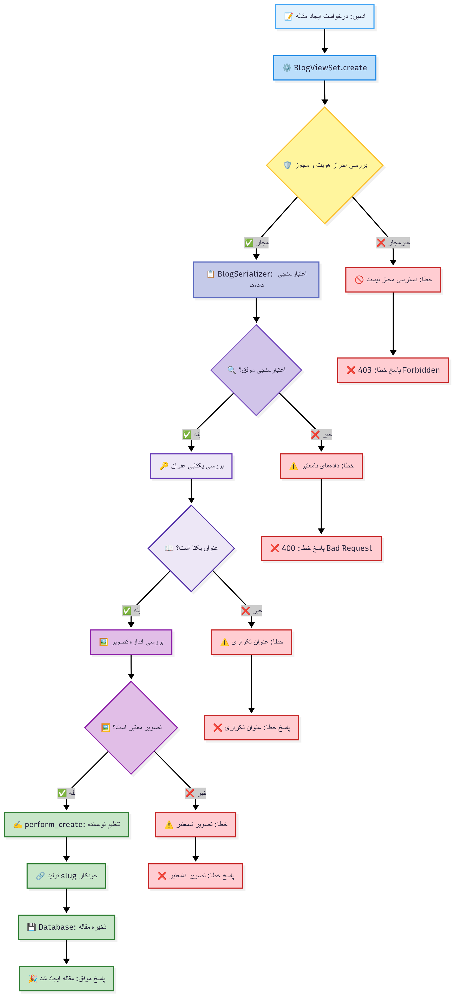
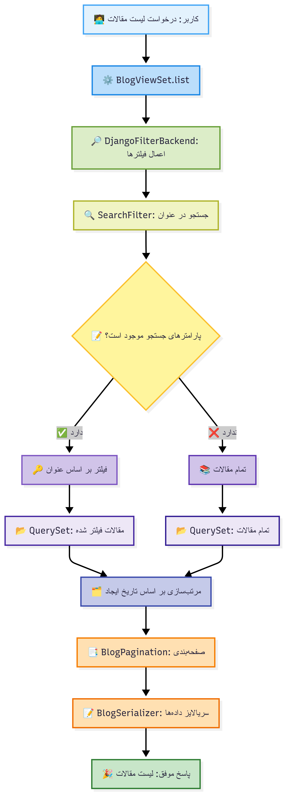
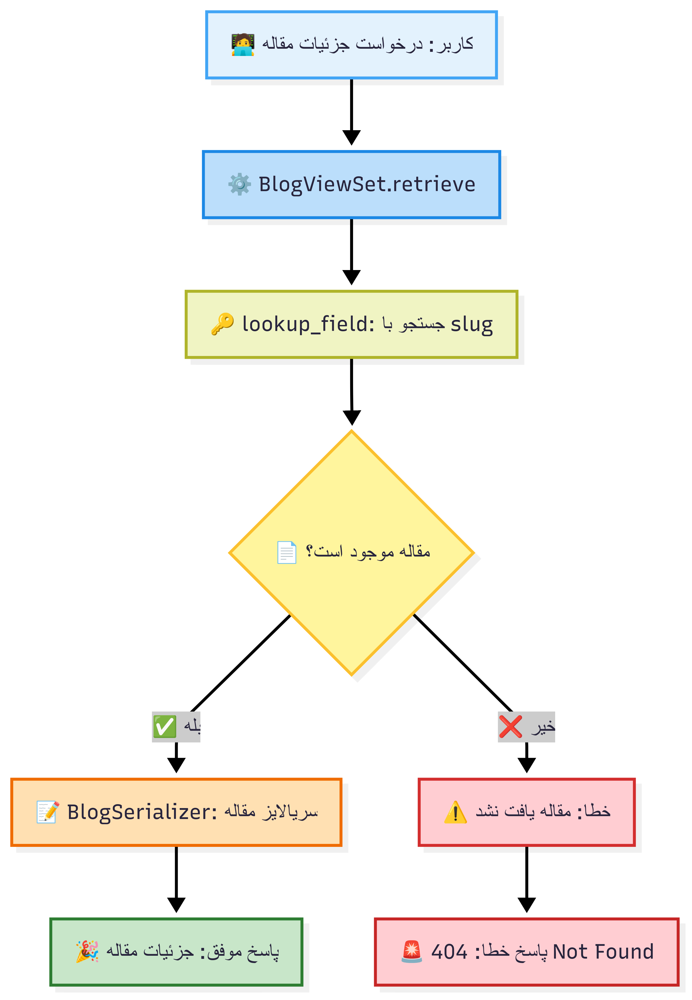
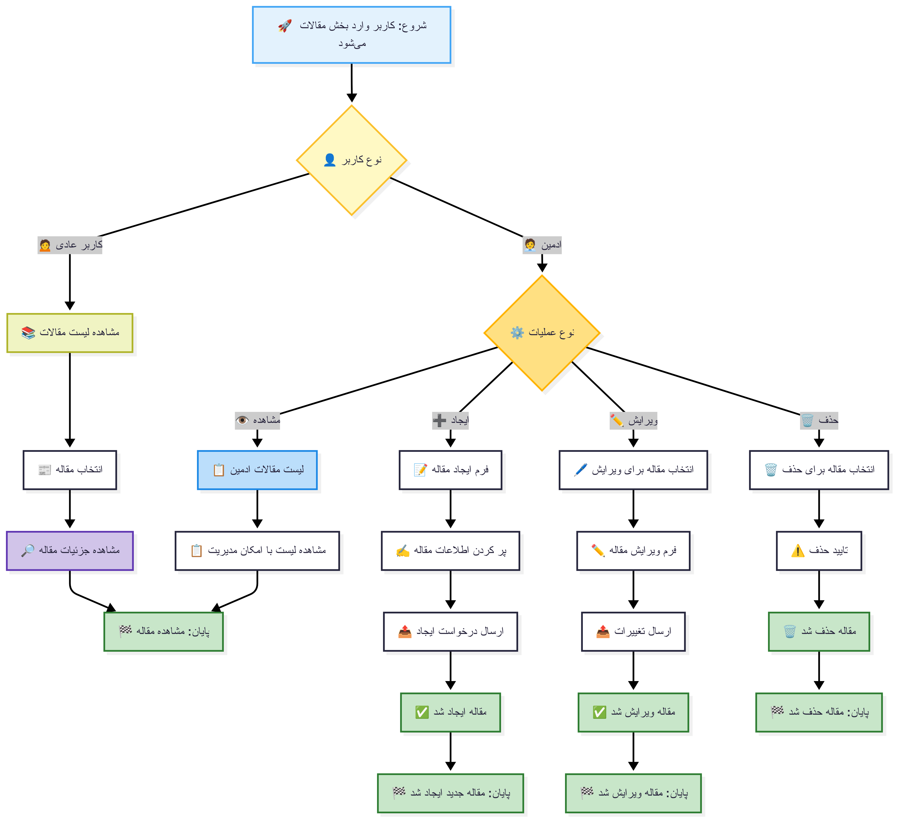

# فلوهای مدیریت مقالات - Blog App

این سند شامل نمودارهای ساده فلوهای مدیریت مقالات سیستم Learnfolio است که با استفاده از Mermaid.js ترسیم شده‌اند.

## 1. فلو ایجاد مقاله جدید

این فلو زمانی اجرا می‌شود که ادمین می‌خواهد مقاله جدیدی ایجاد کند.

## 2. فلو لیست مقالات با جستجو و صفحه‌بندی

این فلو برای نمایش لیست مقالات با قابلیت جستجو و صفحه‌بندی استفاده می‌شود.

## 3. فلو نمایش جزئیات مقاله

این فلو برای نمایش جزئیات یک مقاله خاص با استفاده از slug استفاده می‌شود.

## 4. فلو ویرایش مقاله

این فلو برای ویرایش مقاله توسط ادمین استفاده می‌شود.

## 5. فلو حذف مقاله

این فلو برای حذف مقاله توسط ادمین استفاده می‌شود.

## 6. فلو کامل مدیریت مقالات

این نمودار فلو کامل مدیریت مقالات از ابتدا تا انتها را نشان می‌دهد.

---

# توضیحات تفصیلی کلاس‌ها و متدهای مدیریت مقالات

## 🔐 کلاس‌های اصلی API

### **BlogViewSet**
- **ارث‌بری**: `ModelViewSet` از Django REST Framework
- **عملکرد**: مدیریت کامل CRUD برای مقالات
- **مجوزها**: `UserAdminOrReadOnly` (ادمین‌ها: تمام عملیات، سایرین: فقط خواندن)
- **lookup_field**: `slug` (جستجو بر اساس slug به جای id)
- **مسیر پایه**: `/api/blog/v1/blogs/`

#### **متدهای اصلی:**

#### **list() - لیست مقالات**
- **متد HTTP**: `GET /api/blog/v1/blogs/`
- **عملکرد**: نمایش لیست تمام مقالات با صفحه‌بندی و جستجو
- **فیلترها**: 
  - `SearchFilter`: جستجو در فیلد `title`
  - `DjangoFilterBackend`: فیلترهای پیشرفته
- **صفحه‌بندی**: `BlogPagination`
- **مرتب‌سازی**: بر اساس `created_at` (جدیدترین اول)

#### **retrieve() - جزئیات مقاله**
- **متد HTTP**: `GET /api/blog/v1/blogs/{slug}/`
- **عملکرد**: نمایش جزئیات یک مقاله خاص
- **جستجو**: بر اساس `slug`
- **خروجی**: تمام اطلاعات مقاله شامل محتوا، نویسنده، تاریخ‌ها

#### **create() - ایجاد مقاله**
- **متد HTTP**: `POST /api/blog/v1/blogs/`
- **عملکرد**: ایجاد مقاله جدید توسط ادمین
- **اعتبارسنجی**: 
  - یکتایی عنوان
  - اجباری بودن تصویر
  - محدودیت حجم تصویر (5MB)
- **منطق**: `perform_create()` → تنظیم خودکار نویسنده
- **خروجی**: پیام موفقیت + داده‌های مقاله

#### **update() - ویرایش مقاله**
- **متد HTTP**: `PUT/PATCH /api/blog/v1/blogs/{slug}/`
- **عملکرد**: ویرایش مقاله موجود
- **اعتبارسنجی**: مشابه create
- **منطق**: به‌روزرسانی slug در صورت تغییر عنوان
- **خروجی**: پیام موفقیت + داده‌های به‌روزرسانی شده

#### **destroy() - حذف مقاله**
- **متد HTTP**: `DELETE /api/blog/v1/blogs/{slug}/`
- **عملکرد**: حذف مقاله
- **خروجی**: پیام موفقیت با status 204

## 🛠️ سریالایزرها

### **BlogSerializer**
**فیلدها:**
- `id`: شناسه منحصربه‌فرد (خواندنی)
- `title`: عنوان مقاله (اجباری، یکتا، حداکثر 200 کاراکتر)
- `slug`: نامک مقاله (خودکار، خواندنی)
- `content`: محتوای مقاله (RichText، اجباری)
- `image`: تصویر کاور (اجباری، حداکثر 5MB)
- `author`: نویسنده (خودکار از AdminProfile)
- `created_at`: تاریخ ایجاد (خواندنی)
- `updated_at`: تاریخ آخرین ویرایش (خواندنی)

**اعتبارسنجی‌های سفارشی:**
- `validate_image()`: بررسی نوع و حجم تصویر
- `UniqueValidator`: یکتایی عنوان
- پیام‌های خطای فارسی

## 🔒 لایه‌های امنیتی

### **مجوزها (Permissions)**
#### **UserAdminOrReadOnly**
- **منطق**: 
  - ادمین‌ها: دسترسی کامل (CRUD)
  - کاربران عادی: فقط خواندن (Read)
  - کاربران غیر وارد شده: فقط خواندن
- **بررسی**: `user.is_staff` یا وجود `admin_profile`

### **اعتبارسنجی داده‌ها**
- **عنوان**: یکتایی، طول مناسب، غیرخالی
- **محتوا**: غیرخالی، پشتیبانی از RichText
- **تصویر**: نوع معتبر، حجم مناسب، اجباری

## ⚡ مدیریت کارایی

### **صفحه‌بندی (Pagination)**
- **کلاس**: `BlogPagination`
- **هدف**: بهبود عملکرد در لیست‌های طولانی
- **پیکربندی**: تعداد آیتم‌ها در هر صفحه

### **جستجو و فیلتر**
- **SearchFilter**: جستجوی سریع در عنوان
- **DjangoFilterBackend**: فیلترهای پیشرفته
- **مرتب‌سازی**: بر اساس تاریخ ایجاد

### **بهینه‌سازی پایگاه داده**
- **ordering**: مرتب‌سازی پیش‌فرض در مدل
- **slug indexing**: ایندکس روی فیلد slug
- **related_name**: بهینه‌سازی روابط

## 📊 مدل داده

### **Blog Model**
**فیلدها:**
- `title`: CharField(max_length=200, unique=True)
- `slug`: SlugField(max_length=220, unique=True, auto-generated)
- `content`: RichTextUploadingField() (CKEditor)
- `image`: ImageField(upload_to='blog_covers/')
- `author`: ForeignKey(AdminProfile, SET_NULL)
- `created_at`: DateTimeField(auto_now_add=True)
- `updated_at`: DateTimeField(auto_now=True)

**ویژگی‌های خاص:**
- **Auto Slug**: تولید خودکار slug از عنوان
- **Unicode Support**: پشتیبانی از کاراکترهای فارسی
- **Soft Delete**: نویسنده null می‌شود در صورت حذف AdminProfile
- **Ordering**: مرتب‌سازی بر اساس تاریخ ایجاد

## 🎯 ویژگی‌های کلیدی

### 📝 مدیریت محتوا
- ایجاد، ویرایش، حذف مقالات توسط ادمین‌ها
- محتوای غنی با CKEditor
- مدیریت تصاویر کاور
- تولید خودکار slug از عنوان

### 🔍 جستجو و مرور
- جستجوی سریع در عنوان مقالات
- صفحه‌بندی برای عملکرد بهتر
- مرتب‌سازی بر اساس تاریخ
- دسترسی عمومی برای خواندن

### 🛡️ امنیت
- کنترل دسترسی بر اساس نقش کاربر
- اعتبارسنجی کامل داده‌های ورودی
- محدودیت حجم و نوع تصاویر
- پیام‌های خطای کاربرپسند

### ⚡ عملکرد
- صفحه‌بندی هوشمند
- ایندکس‌گذاری مناسب
- بهینه‌سازی کوئری‌ها
- کش‌سازی قابلیت توسعه
